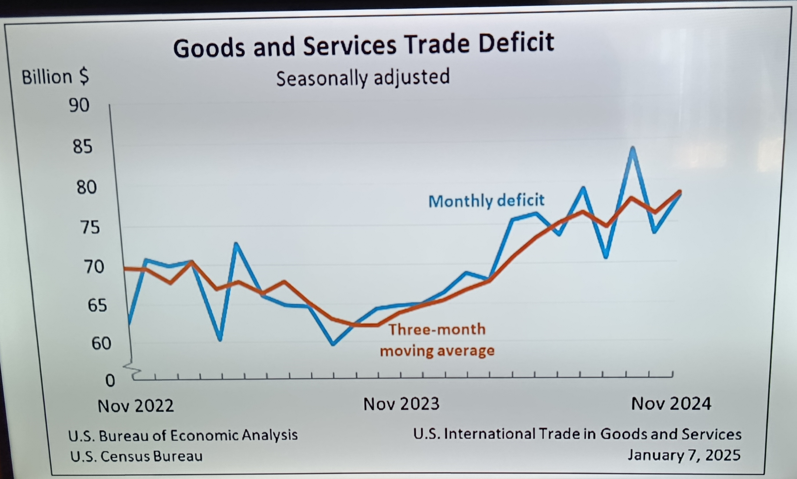

# Pharmaceutical Sales Forecasting
**Course:** _DA5020 - Collecting, Storing, and Analyzing Data_

## Overview
This project simulates a real-world scenario where a pharmaceutical company needs to prepare fiscal year-end sales forecasts and presentation materials for senior leadership. The goal was to analyze provided data, generate insights, and create visual assets to support executive-level decision-making. This project follows the CRISP-DM framework, and the final output is a reproducible R Notebook report combining narrative, analysis, and code.

## Scenario
The end of the fiscal has arrived and Dr. Alicia Kerns, the CFO for Plaxium LLC, needs to get ready for a presentation to the senior leadership team at the next offsite. Last week, Alicia was attending a presentation and the presenter showed, what she thought, was a nice and effective chart. She felt that it was a well done visualization as it was simple and got the point across. For her upcoming presentation she wants to include a similar chart in her presentation deck, so she calls you to assist her. She took a photo of the chart with her phone and sent it to you. 

Your task is to take the data that was prepared by Arjun Patel in the CFO's Office and create a similar graph -- matching what is shown below as closely as possible (but keeping in mind that the sample graph was not done using R). In addition, she would like to add a forecast for the next two months on the chart as well. Alicia knows she'll also need a few other charts and perhaps some tables for her slide deck. 

## Deliverables
### Tables
* Quarterly revenue per year
* Average monthly revenue, expenses, and profit/loss across years
* Percentage Change in revenue, expenses, and profit/loss month-to-month

### Forecasting
Short-term forecast for revenue and expenses using a weighted moving average (WMA) model

### Profit & Loss Month Chart
* Blue line: Actual profit/loss (revenue - expenses)
* Red line: 3-month WMA (weights: 0.6, 0.3, 0.1)
* Includes adjusted titles, axis labels, and source attribution

## Files
* R Notebook
* Knitted html report
  
## Tools & Skills
### Languages & Environment: 
* R
* RStudio

## Dependencies
This project uses the following packages:
* lubridate
* dplyr
* knitr
* kableExtra
* tibble
* ggplot2

### Techniques:
* Data wrangling and cleaning
* Handling missing values and outliers
* Time-series forecasting
* Data aggregation and summary tables
* Data visualization

## Methodology

1. **Load data** from [dataset](https://s3.us-east-2.amazonaws.com/artificium.us/datasets/pharma-sales-randomized.tsv)  
2. **Prepare and shape data**  
   - Format data  
   - Handle missing/outlier data  
   - Calculate profit and losses  
3. **Aggregate data** into quarterly and monthly tables  
4. **Forecast** revenue and expenses with a weighted moving average (0.6, 0.3, 0.1)  
5. **Visualize** profit & loss trends with forecasting overlay, formatted for presentation use  

## Results
The [final report](https://zoechow24.github.io/pharma-sales-forecast/pharma-sales-forecast.html) provides executive-ready tables, time-series forecasts, and polished visualizations, offering clear insights into revenue, expenses, and profit/loss trends. It also includes fully reproducible R code, ensuring transparency and repeatability.

   

